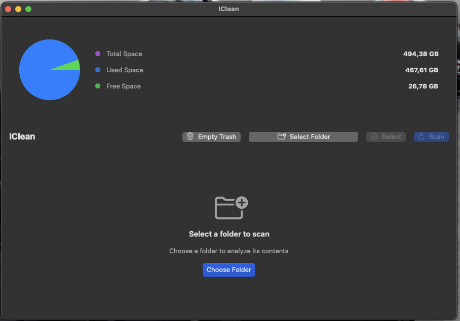

# IClean

IClean is a native macOS application built with SwiftUI that helps users manage their disk space by identifying and removing large files.



## Features

- 📊 Visual disk space overview with interactive pie chart
- 🔍 Scan folders for large files (>100MB)
- 🗑️ Empty trash with a single click
- 📁 Show files in Finder
- ✨ Modern macOS design with native UI components
- 🔒 Protected system paths detection
- 🖼️ File icons preview
- ⚡️ Asynchronous file scanning
- 🔄 Real-time disk space monitoring

## Requirements

- macOS 11.0 or later
- Xcode 13.0 or later

## Installation

1. Clone the repository: 

```bash
git clone https://github.com/cardoso222/IClean.git
```

2. Open the project in Xcode:

```bash
cd IClean
open IClean.xcodeproj
```

3. Build and run the project (⌘+R)

## Usage

1. Launch IClean
2. Click "Select Folder" to choose a directory to scan
3. Wait for the scan to complete
4. Browse through the list of large files
5. Select files to delete or use the context menu to:
   - Show files in Finder
   - Delete individual files
   - Select/deselect files

## Contributing

1. Fork the repository
2. Create your feature branch (`git checkout -b feature/AmazingFeature`)
3. Commit your changes (`git commit -m 'Add some AmazingFeature'`)
4. Push to the branch (`git push origin feature/AmazingFeature`)
5. Open a Pull Request

## License

This project is licensed under the MIT License - see the [LICENSE](LICENSE) file for details.

## Acknowledgments

- Built with SwiftUI and native macOS frameworks
- Icons from SF Symbols
- Inspired by macOS's native design guidelines

## Support

For support, please open an issue in the GitHub repository or contact the maintainers.

---

Made with ❤️ for macOS